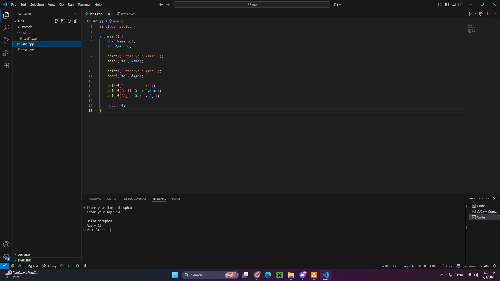

# ENGCC304
## โจทย์
จงแก้ไขโค้ดต่อไปนี้ ให้สามารถรับค่าจากผู้ใช้ เพื่อแสดงผลบนหน้าจอคอมพิวเตอร์ให้ได้ พร้อมทั้งจัดรูปแบบให้ตรงตาม Syntax ที่เรียนมาในห้องเรียน

```c++
#include <stduio.h>

int main() {
    char Name[50] ;
    int  Age = 0 ;
    printf( "Enter your name: " ) 
    scanf( "%s", Name ) ;
    printf( "Enter your age: " ) ;
    scanf( "%d", Age ) ;
    print( "- - - - - -\n" ) ;
    printf( "Hello %s \n", ___ ) ; 
    printf( "Age = %d\n", ___ ) ; 
    
}//end main function
```


